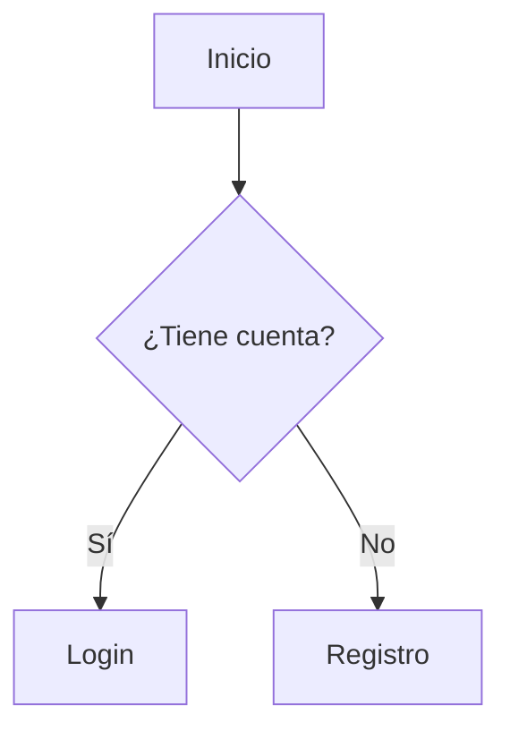
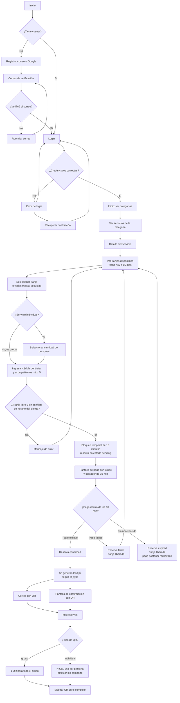
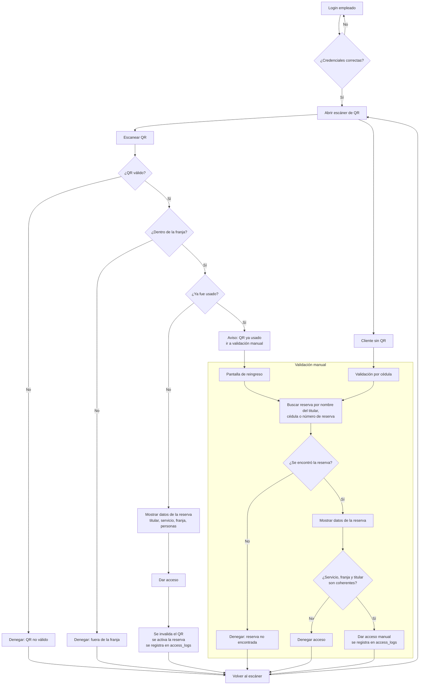
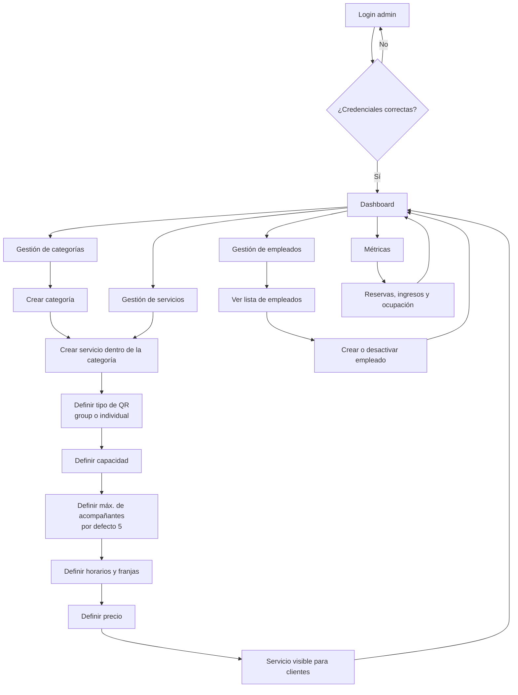
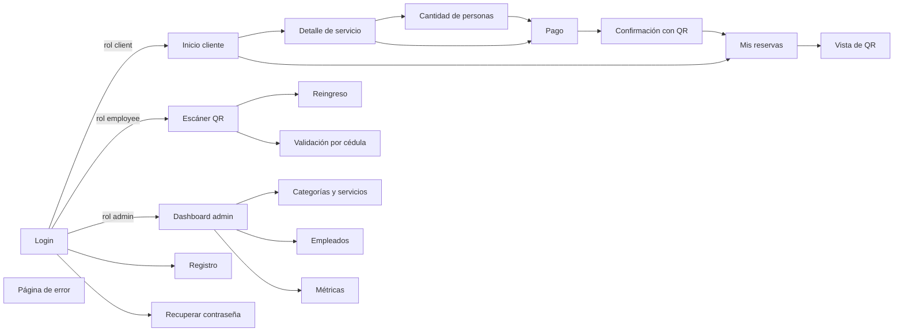

# Wireframes y Flujos de Usuario

> Documento de diseño · Fase 1 · Sistema de Reservas — Complejo Deportivo
> Archivo: `docs/diseño/ui-flujos.md` · Rama: `docs/ui-flujos`
> Referencias: Capa de Diseño (Dev 6), Respuestas del Cliente, `architecture.md`.

---

## 1. Cómo hacer los flujos

Los flujos se escriben directamente en este archivo usando **Mermaid**. Es un lenguaje de texto que GitHub renderiza automáticamente como diagrama de cajas y flechas. No requiere instalar nada ni exportar imágenes.

**Sintaxis básica:**
- `A[Texto]` → caja con texto
- `A --> B` → flecha de A a B
- `A{Texto}` → caja de decisión (rombo)
- `A -->|Sí| B` → flecha con etiqueta

**Ejemplo mínimo:**

---

## 2. Flujos que se necesitan

### Reglas de negocio que afectan los flujos

Estas reglas vienen del documento *Respuestas del Cliente* y deben verse reflejadas en las pantallas:

| Regla | Efecto en el flujo |
|---|---|
| Bloqueo de pago de **10 minutos** | Pantalla de pago con contador. Si vence, la franja se libera y un pago posterior se rechaza. |
| Anticipación máxima **15 días** | El selector de fecha no permite fechas pasadas ni más allá de 15 días. |
| Sin dos reservas en el mismo horario | Si hay conflicto, se muestra error antes de bloquear la franja. Sin límite de reservas en horarios distintos. |
| `qr_type = group` (canchas) | 1 solo QR por reserva; entra todo el grupo. |
| `qr_type = individual` (piscinas, zonas húmedas, gimnasio) | Se elige **cantidad de personas** antes del pago y se generan **N QR**, uno por persona. |
| Acompañantes: máximo 5, no consumen cupo | Se informan en la reserva pero no cuentan en la cantidad de personas. |
| Cédula del titular | Se registra al reservar; sirve para el ingreso sin QR. |
| QR de un solo uso | El primer escaneo activa la reserva. El reingreso se valida manualmente. |
| Solo pago en línea, sin cancelaciones ni reembolsos | No hay pantalla de cancelación ni pago presencial. El no-show se cobra igual. |

---

### Flujo del Cliente

**Cobertura de los pasos requeridos:**

- Registro → verificación por correo → login ✅
- Ver categorías → ver servicios → ver franjas ✅
- Seleccionar franja → bloqueo temporal → pago con Stripe ✅
- Pago exitoso → recibe QR por correo ✅
- Pago fallido → franja liberada ✅
- Mostrar QR en el complejo ✅

---

### Flujo del Empleado

**Notas del flujo:**

- El empleado **solo valida**, no cuenta personas.
- La **llegada tardía** se permite si la información es coherente con la reserva.
- Los reingresos dentro de la misma franja siempre pasan por validación manual.
- En servicios grupales (cancha), los acompañantes no entran sin el titular.
- Varios empleados escanean a la vez en distintas zonas; si dos escanean el mismo QR, solo el primero activa la reserva y el segundo recibe "ya usado".

---

### Flujo del Admin

**Cobertura de los pasos requeridos:**

- Login → dashboard ✅
- Crear categoría → crear servicio → definir capacidad → definir horarios ✅
- Servicio visible para clientes ✅
- Gestionar empleados ✅
- Ver métricas ✅

---

### Navegación entre pantallas

Cómo se conectan los tres flujos y las pantallas comunes:

---

## 3. Cómo hacer los wireframes

Un wireframe es el esqueleto de una pantalla: estructura y disposición de los elementos, sin diseño visual final.

**Pasos:**
1. En Figma, crear un frame de **375 x 800** (tamaño celular).
2. Dibujar cajas rectangulares para cada sección (header, contenido, botones).
3. Escribir dentro de cada caja qué representa (ej. "Logo", "Lista de servicios", "Botón Reservar").
4. Todo en blanco, negro o gris. Sin colores.
5. Una pantalla por frame.

> Coordinar con Dev 5: cuando el sistema visual esté listo, se aplican los componentes sobre estos wireframes en la Fase 2.

---

## 4. Wireframes que se necesitan

**Obligatorios:**

| # | Pantalla | Secciones dentro del frame |
|---|---|---|
| 1 | **Login** | Logo · Campo correo · Campo contraseña · Botón "Iniciar sesión" · Botón "Continuar con Google" · Enlace "¿Olvidaste tu contraseña?" · Enlace "Crear cuenta" |
| 2 | **Registro** | Logo · Campos nombre, correo, contraseña · Botón "Crear cuenta" · Botón Google · Aviso "Te enviaremos un correo de verificación" · Enlace "Ya tengo cuenta" |
| 3 | **Inicio (categorías)** | Header con menú y "Mis reservas" · Saludo · 4 tarjetas de categoría: Canchas, Piscinas, Zonas húmedas, Gimnasio · Lista de servicios de la categoría elegida |
| 4 | **Detalle de servicio + selección de franja** | Imagen del servicio · Nombre, descripción y precio · Selector de fecha (hoy a 15 días) · Grilla de franjas (libre / ocupada) · Selección de franjas seguidas · Botón "Reservar" |
| 5 | **Pago** | Resumen de la reserva (servicio, fecha, franja, personas) · Contador regresivo de 10 min · Campo de cédula del titular · Formulario de tarjeta Stripe · Total a pagar · Botón "Pagar" · Aviso "Sin cancelaciones ni reembolsos" |
| 6 | **Confirmación con QR** | Mensaje "Reserva confirmada" · Datos de la reserva · QR (uno para grupal, varios para individual) · Nota "Enviamos los QR a tu correo" · Botón "Ir a Mis reservas" |
| 7 | **Dashboard Admin** | Menú lateral (Categorías, Servicios, Empleados, Métricas) · Tarjetas de métricas (reservas del día, ocupación, ingresos) · Gráfica · Tabla de últimas reservas |
| 8 | **Escaneo QR (empleado)** | Header con nombre del empleado · Visor de cámara · Botón "Validar sin QR" · Área de resultado (válido / denegado) con datos de la reserva · Botón "Dar acceso" |

**Adicionales (por las decisiones del cliente):**

| # | Pantalla | Secciones dentro del frame |
|---|---|---|
| 9 | **Selección de cantidad de personas** (solo servicios individuales, antes del pago) | Resumen del servicio y franja · Selector −/+ de personas · Cupo disponible · Total según cantidad · Botón "Continuar al pago" |
| 10 | **Vista de múltiples QR** (titular de reserva individual) | Lista o carrusel de N QR con etiqueta "Persona 1, 2, ..." · Estado de cada QR (disponible / usado) · Botón "Compartir" por QR · Botón "Compartir todos" |
| 11 | **Reingreso** (empleado) | Buscador por nombre del titular, cédula o número de reserva · Lista de resultados · Datos de la reserva (servicio, franja, titular) · Botón "Permitir ingreso" · Botón "Denegar" |
| 12 | **Validación por cédula** (empleado) | Campo de cédula · Botón "Buscar reserva" · Datos de la reserva encontrada · Botón "Dar acceso manual" · Mensaje si no se encuentra |
| 13 | **Mis reservas** (cliente) | Pestañas próximas / pasadas · Tarjetas con servicio, fecha, franja y estado · Botón "Ver QR" |
| 14 | **Recuperar contraseña** | Campo de correo · Botón "Enviar enlace" · Enlace "Volver al login" |
| 15 | **Página de error** | Código de error · Mensaje claro · Botón "Volver al inicio" |
| 16 | **Estados del pago** (fallido / tiempo vencido) | Mensaje "Franja liberada" · Motivo · Botón "Elegir otra franja" |
| 17 | **Gestión de categorías, servicios y horarios** (admin) | Tabla de servicios · Botón "Nuevo servicio" · Formulario: nombre, categoría, tipo de QR, capacidad, máx. acompañantes, precio, horarios |
| 18 | **Gestión de empleados** (admin) | Tabla de empleados · Botón "Nuevo empleado" · Acciones activar / desactivar |

---

## 5. Checklist de entrega

- [ ] Flujo del Cliente, Empleado y Admin en Mermaid (este archivo)
- [ ] Navegación entre pantallas
- [ ] Wireframes obligatorios (1–8) en Figma, frame 375 x 800, sin colores
- [ ] Wireframes adicionales (9–12) por las decisiones del cliente
- [ ] Enlace al archivo de Figma agregado en este documento
- [ ] Solo se modificó `docs/diseño/ui-flujos.md`
- [ ] PR abierto desde `docs/ui-flujos` hacia `develop`, con el Tech Lead como reviewer

**Enlace a Figma:** _(pegar aquí)_

---

## 6. Notas para el reviewer

- Se dejó el flujo de validación manual (reingreso y cédula) como parte del flujo del Empleado, porque el cliente confirmó que el reingreso no usa QR.
- El orden de validaciones del escáner sigue el pedido: QR válido → dentro de franja → ya usado. Si el QR ya fue usado, se deriva a validación manual.
- Pendiente de validar con Dev 2 y Dev 3: mensajes de error exactos y si el admin define el precio por franja o por servicio.
