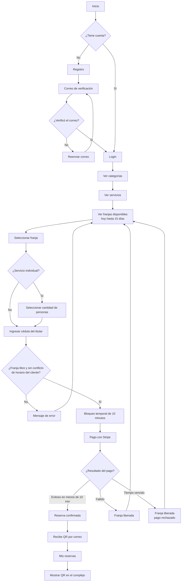
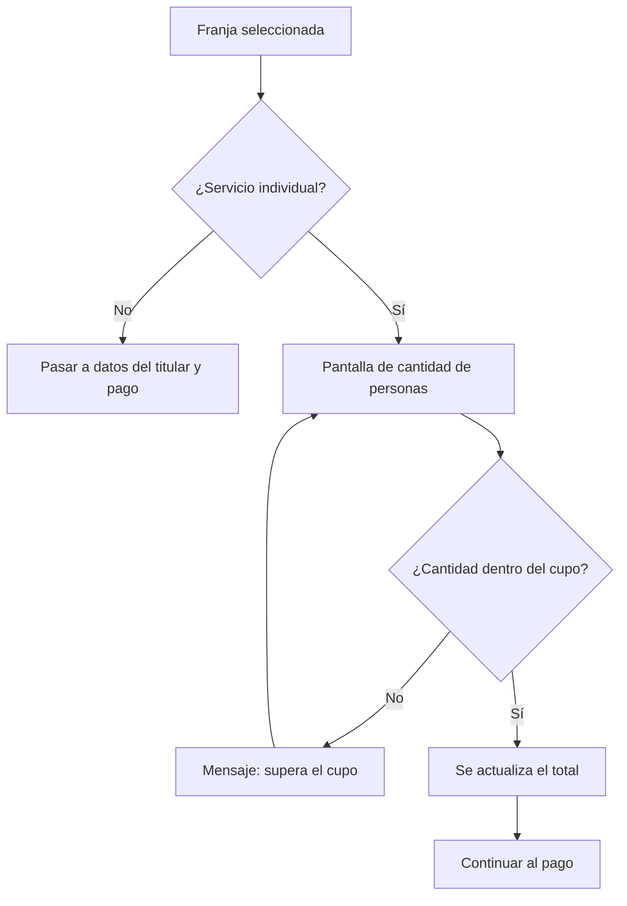
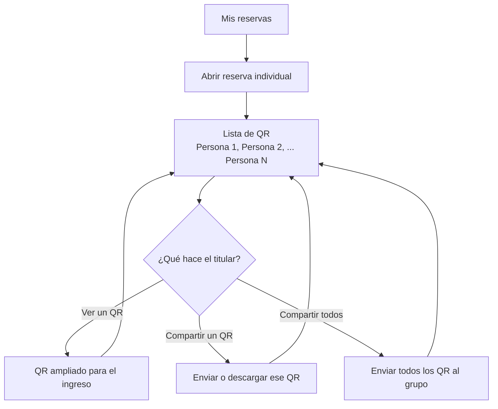
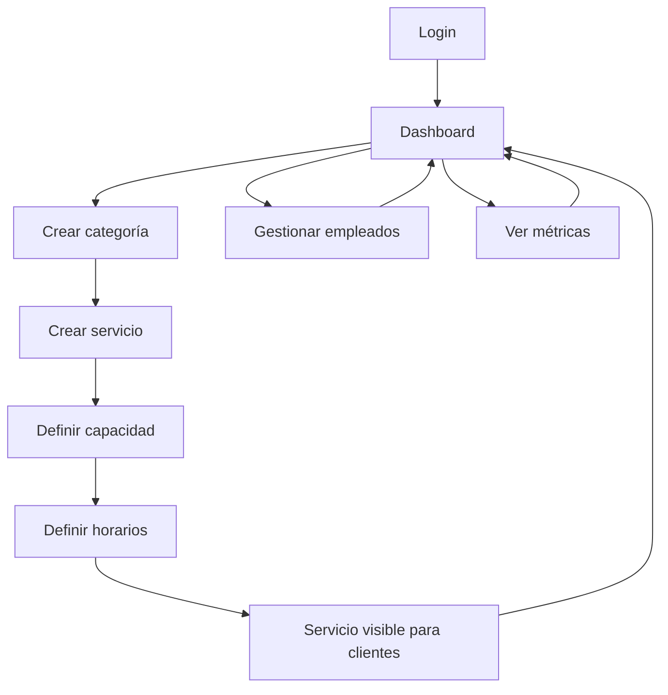
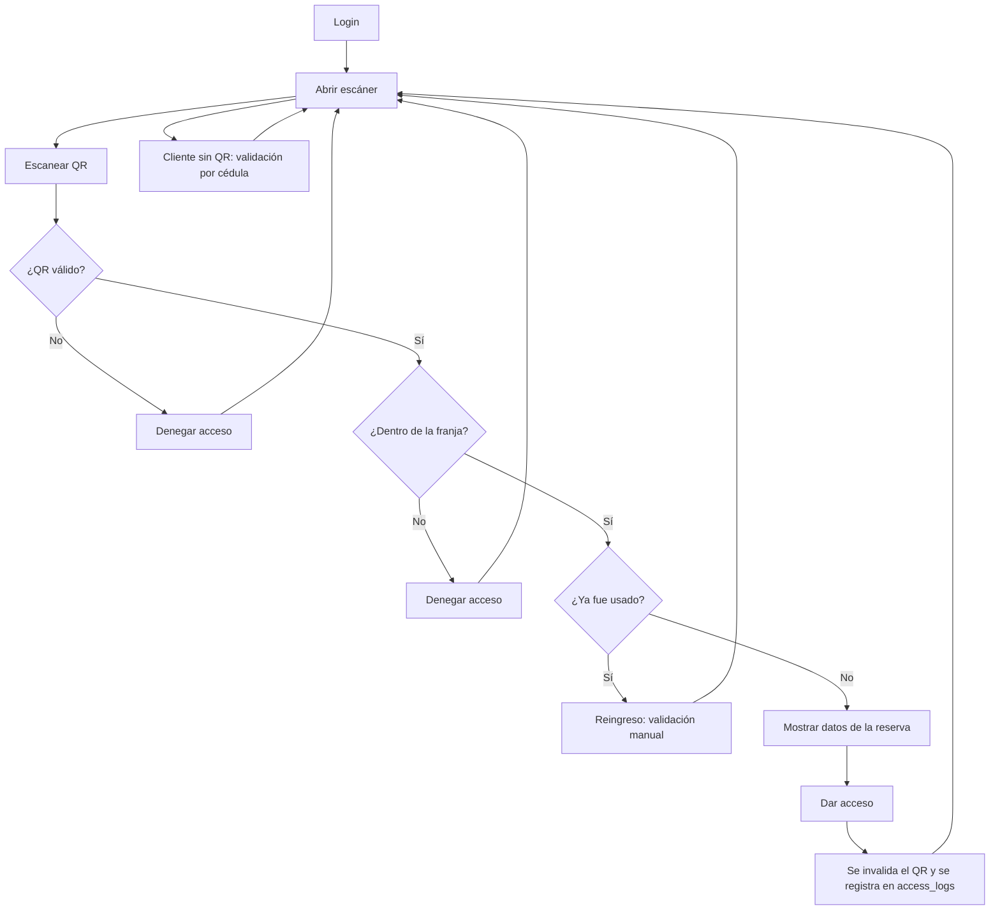
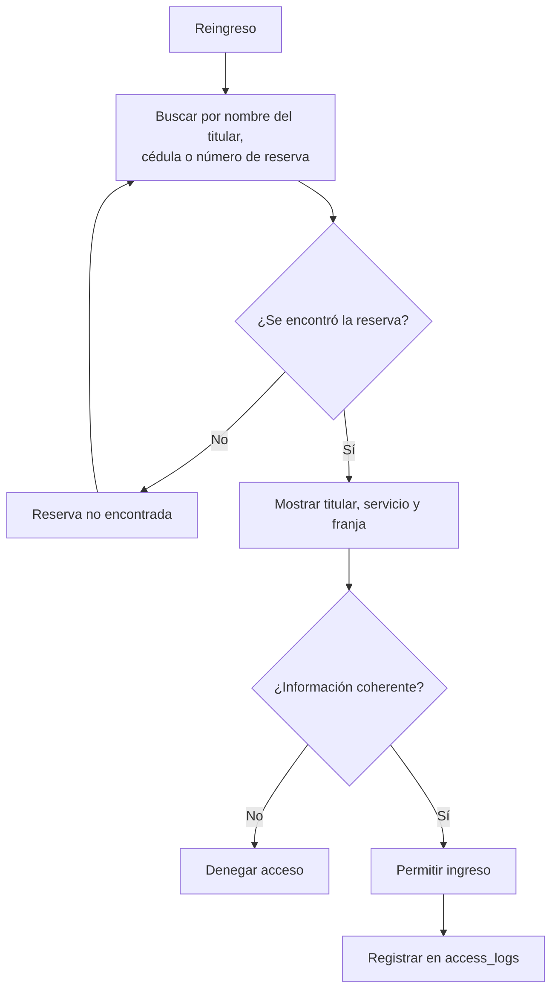
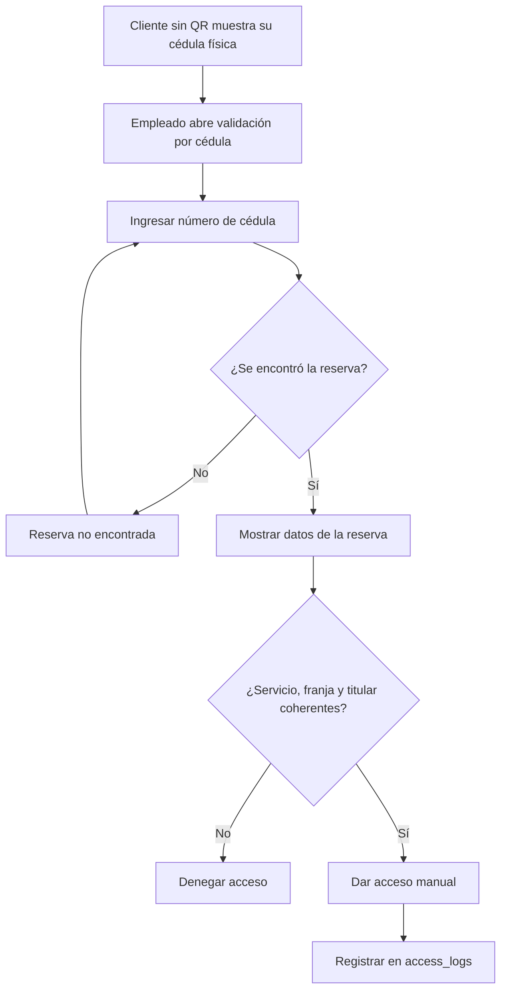
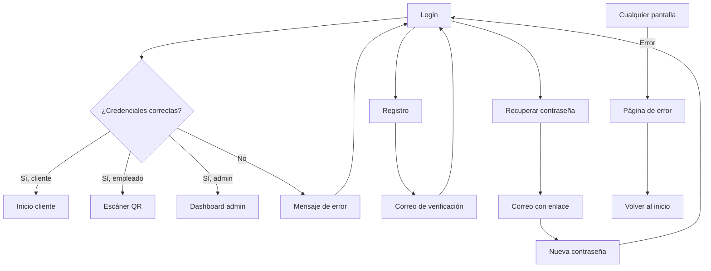
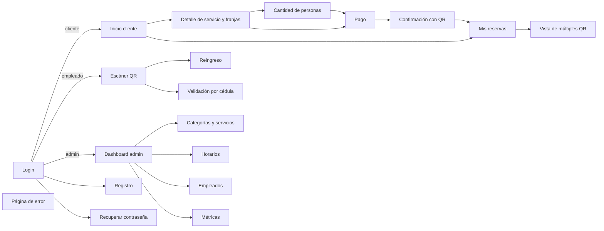

# Flujos de Usuario

> Sistema de Reservas — Complejo Deportivo · Fase 1 — Diseño
> Archivo: `docs/diseño/ui-flujos.md`

## 1. Figma 
    https://www.figma.com/design/1hCC1pNkVWNxanpjJm1oTc/Complejo-Deportivo?node-id=1-2&p=f&t=XutCJIX6stz0bMff-0

    
## 2. Flujos

### 2.1 Flujo del Cliente

---

### 2.2 Selección de cantidad de personas

Solo para servicios individuales, antes del pago.

---

### 2.3 Vista de múltiples QR para el titular

Para servicios grupales (cancha) se muestra un único QR para todo el grupo.

---

### 2.4 Flujo del Admin

---

### 2.5 Flujo del Empleado

---

### 2.6 Pantalla de reingreso

---

### 2.7 Pantalla de validación por cédula

---

### 2.8 Pantallas comunes

---

### 2.9 Navegación entre pantallas

