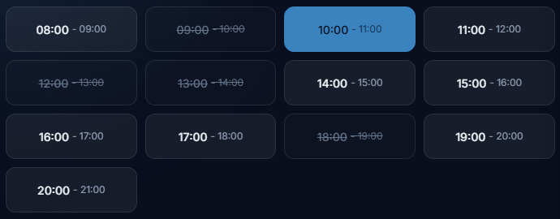

OBJETIVO:
Crear el componente Chip para representar franjas horarias seleccionables en la vista de reserva.

QUÉ ES UN CHIP:
Es un botón cuadrado pequeño que muestra una hora específica (ej. "08:00"). Se usa para que el cliente seleccione una o varias franjas horarias al reservar un servicio.

Ejemplo visual de los 3 estados:
[ 08:00 ]       ← libre (borde gris, fondo transparente)
[̶ ̶0̶9̶:̶0̶0̶ ̶]      ← ocupada (texto tachado, fondo oscuro)
[ 10:00 ]       ← seleccionada (fondo primary, texto blanco)

REFERENCIA EN FIGMA:

Pantalla de reserva (Detalle de servicio + Franja) → grid de franjas horarias.

DOCUMENTACIÓN:

docs/diseño/ui-sistema.md sección 7.1 (Chip de franja).

PROPS:

time: string (obligatorio, ej. "08:00")

state: 'libre' | 'ocupada' | 'seleccionada' (obligatorio)

onClick?: () => void (opcional, solo si state es 'libre' o 'seleccionada')

disabled?: boolean (default: false)

className?: string

ESTRUCTURA:

Rectángulo con altura 44px y ancho mínimo 88px.

Texto centrado: la hora en formato 24h (ej. "08:00").

Radio 8px.

ESTADOS:

libre:

Fondo: bg-surface.

Borde: 1px border-border.

Texto: text-text-primary.

Cursor: pointer.

Hover: borde primary.

ocupada:

Fondo: bg-surface con opacidad reducida.

Borde: 1px border-border.

Texto: text-text-disabled.

Texto tachado (line-through).

Cursor: not-allowed.

Sin hover.

seleccionada:

Fondo: bg-primary.

Borde: 1px primary.

Texto: blanco.

Cursor: pointer.

Hover: bg-primary-hover.

COMPORTAMIENTO:

Si state es 'libre' o 'seleccionada' → clickeable.

Si state es 'ocupada' → NO clickeable (disabled).

Al hacer clic, llama a onClick (que el padre maneja para alternar el estado).

EJEMPLOS DE USO:

Grid de franjas:

<Chip time="08:00" state="libre" onClick={() => toggleSlot('08:00')} />
<Chip time="09:00" state="ocupada" />
<Chip time="10:00" state="seleccionada" onClick={() => toggleSlot('10:00')} />

Franja deshabilitada por fecha pasada:
<Chip time="08:00" state="ocupada" disabled />

CARACTERÍSTICAS:

Client Component ('use client') porque maneja clicks.

Accesible: button HTML con aria-disabled cuando está ocupado.

Focus visible con anillo primary.

REFERENCIA DE CÓDIGO:

Mira src/components/ui/Button.tsx como ejemplo de estructura, tipos y estilos.

Usa los tokens de Tailwind (bg-primary, bg-surface, border-border, etc.).

NO valores hardcodeados.

CRITERIOS DE ACEPTACIÓN:

Los 3 estados se renderizan correctamente.

El texto tachado se ve bien en el estado "ocupada".

El estado "seleccionada" tiene fondo primary.

Los clicks funcionan solo en estados válidos.

Respeta el sistema visual (dark mode).

Accesible con teclado.